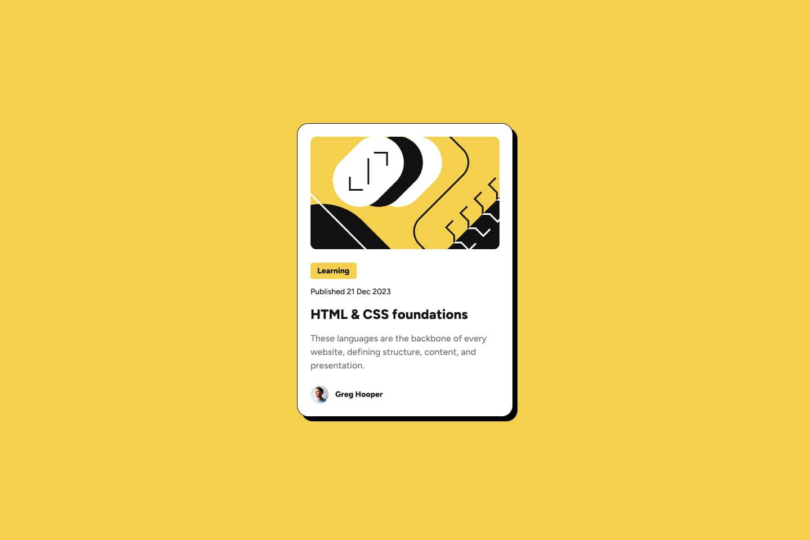

# Desafio #2 Frontend Mentor | Blog Preview Card

Este projeto é o segundo desafio que completei na plataforma Frontend Mentor. O objetivo principal foi reforçar meus conhecimentos em **HTML semântico** e **CSS com Flexbox**, mantendo um código limpo e bem estruturado.

## 🧠 Objetivo do Projeto

O desafio propunha a criação de um componente de cartão de pré-visualização de blog, com foco em:

- Prática de **Flexbox**
- Uso correto da **estrutura semântica**
- Desenvolvimento responsivo e com atenção aos detalhes

## 🛠️ Tecnologias Utilizadas

- HTML5
- CSS3 (puro)

## 💡 Destaques

Neste projeto, priorizei a **semântica do HTML**, estruturando o conteúdo com clareza e propósito. Com isso, fortaleço boas práticas fundamentais para acessibilidade e SEO, mesmo em projetos simples.

## 🌐 Link do Desafio

[Frontend Mentor – Blog Preview Card](https://www.frontendmentor.io/learning-paths/getting-started-on-frontend-mentor-XJhRWRREZd/steps/68138f8a5526abd7449fe32f/challenge/start)

## 🚀 Deploy do Projeto

Acesse a página publicada aqui:  
👉 [https://codebyneander.github.io/blog-preview-card-myproject/](https://codebyneander.github.io/blog-preview-card-myproject/)

## 📌 Observações

Este projeto foi desenvolvido **exclusivamente para fins de prática e treinamento**, como parte da minha evolução contínua em desenvolvimento front-end com base nos desafios da plataforma Frontend Mentor.

---

